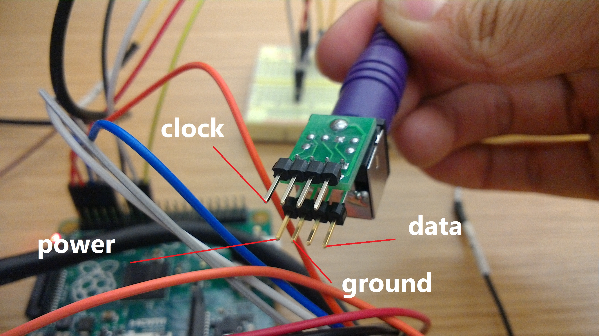
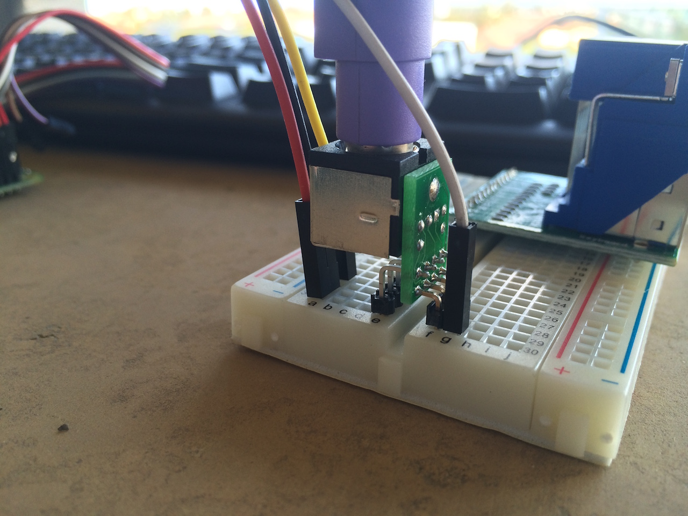
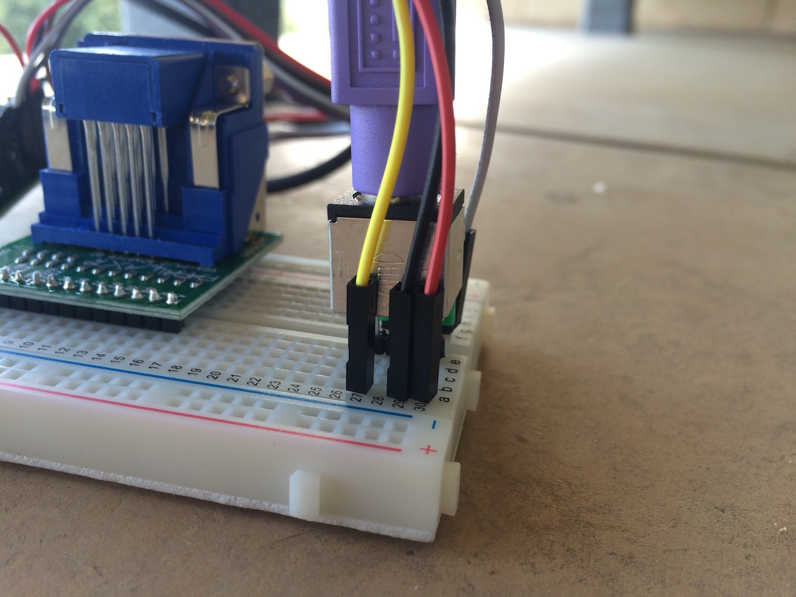
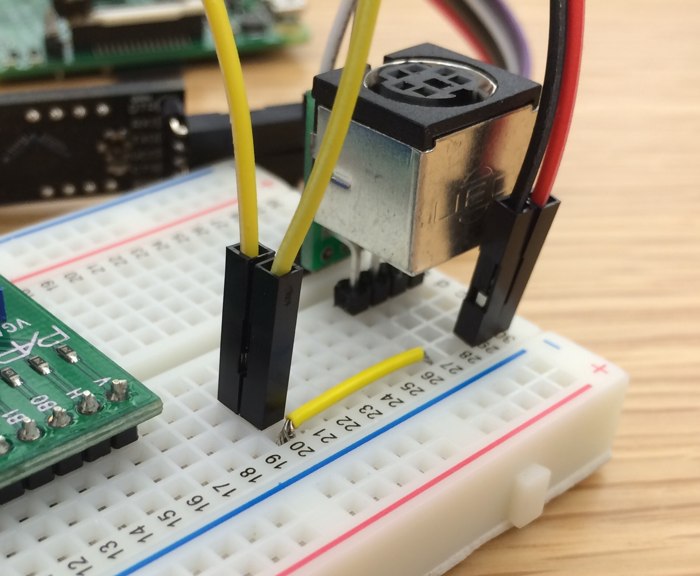
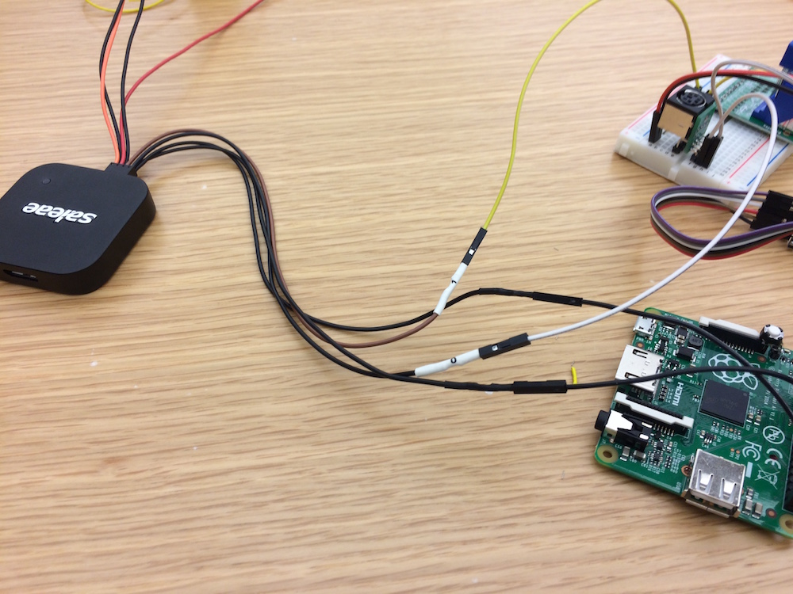
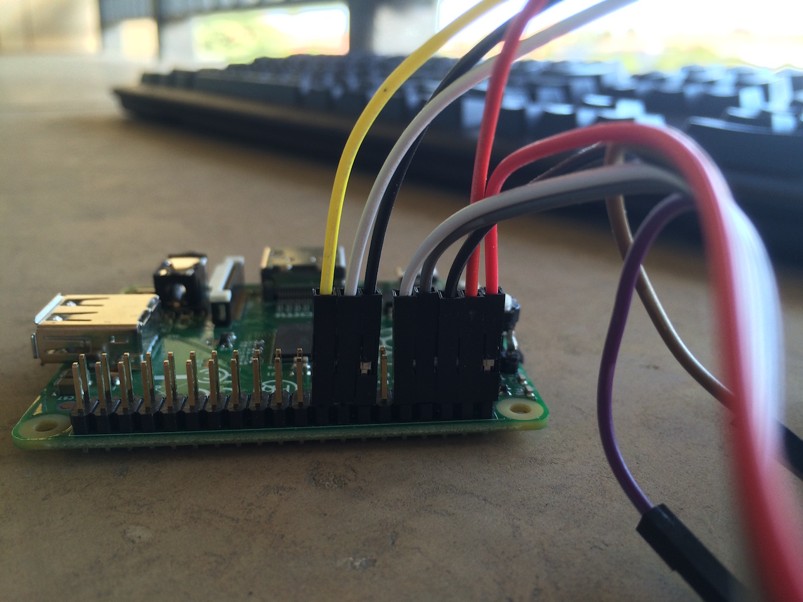

*Lab written by Philip Levis, updated by Pat Hanrahan*

### Learning goals
During this lab you will:

1. Install a PS/2 port onto your breadboard and plug it into your Raspberry Pi.
2. Inspect the PS/2 protocol using a logic analyzer.
3. Test the keyboard to make sure it works with the Raspberry Pi.

In your next assignment, you will read PS/2 scancodes from a keyboard and turn
them into ASCII characters.  This will allow you to type text that
your Raspberry Pi can process.  The goal of the lab is to set up the
keyboard so that you can immediately start on the assignment.

To complete the lab, you must complete the [checklist](checklist).

### Lab exercises

To start this lab, pull from `cs107e.github.io` and go into
the directory `_labs/lab5`. 

#### 1. Add a PS/2 port to your Raspberry Pi (20 min)

Most modern keyboards are USB keyboards.  Unfortunately, the USB
protocol is complicated; it's approximately 2,000 lines of code to
interface a USB keyboard to the Raspberry Pi.  Instead, we will
interface with a PS/2 keyboard, which uses a simple serial protocol
that is easy to decode.  The PS/2 keyboard appeared on the original
IBM PC. Many older USB keyboards can fall back to a PS/2 mode.

There are two common PS/2 devices: a keyboard and a mouse.  PS/2
devices connect to a PC using a 6-pin [mini-DIN connector](https://en.wikipedia.org/wiki/Mini-DIN_connector). By
convention, the mouse uses a green connector and the keyboard uses a
purple connector.

Get a keyboard and a PS/2 port from a TA. Inspect the inside of the keyboard 
connector, you will see that it contains a plastic tab (that forces you to 
plug it in with the correct polarity) and 6 male pins.  Two pins are 
NC (not-connected), and the others carry VCC, GND, DATA and CLK.

Look at the breadboard so the PS/2 port side with the green printed
circuit board is facing you. This is how the pins are arranged:

Plug the PS/2 port into a free area of your breadboard. The PS/2 port
has 8 pins. You'll need to plug it into the center of your board, so
the pins from each side are on different sides of the board.

When we connect jumpers to your breadboard for the PS/2 pins, you
should use the following convention: red for VCC, black for GND,
yellow for DATA, and white for CLK.

Add a male-to-female jumper to each of the four pins, but don't
connect them to your Pi yet.  Your board should look something like this after
this step:

Next, for the CLK and DATA pins, add a second set of jumpers, which
are male-to-male.  These will let you hook these pins up to the logic
analyzer.

Note that the spacing of the PS/2 port makes it difficult to fit two
jumpers for the DATA pin. To make them fit, we added a jumper to
another row on the board:

If you don't want to break out the data line in this way
or crowd the breadboard with too many wires, you can just
use one jumper, swapping to male-to-male for the logic analyzer then swapping
to male-to-female for your Raspberry Pi.

Finally, plug the male-to-female GND and VCC jumpers into 5V and GND pins on
your Raspberry Pi.

#### 2. Use a Logic Analyzer to visualize the PS/2 protocol (30 min)

We will use the Saleae Logic Analyzer to examine the signals 
being sent by the keyboard. Do this in groups of 2 or 3.

First, download and install the *Logic* application from the Saleae
web site. This will visualize the signals captured by the logic analyzer.

[Saleae Download](https://www.saleae.com/downloads)

You may also want to download the 
[user manual](http://downloads.saleae.com/Saleae+Users+Guide.pdf).

Once the installation finishes, launch the application; you should see
a screen similar to the following:

Second, familiarize yourself with the logic analyzer. One side has a USB
port, and the other side has the jumpers. This logic analyzer can
simultaneously watch 8 channels.

Each channel has a pair of jumpers; one for signal, and the other for
ground. In this lab, we will be watching the channels DATA and CLK 
from the keyboard.

Third, connect the logic analyzer to the keyboard. Connect the
male-to-male CLK jumper to channel 0 and the DATA line to channel 1.

The ground line for each channel is directly underneath its signal
wire. Recall from lecture that you need to ground each channel to the
Raspberry Pi to complete the circuit otherwise it can have erratic
behavior. To do this, connect these ground lines to the ground pins on
your Raspberry Pi. Since your keyboard is also connected to the Pi,
the two devices actually share the same ground line! Connect the
Saleae USB cable to the USB port of your computer.

This is what it looks like wired up. 

Fourth, configure the logic analyzer to acquire the signal.

To access the setup options, click the up/down arrow button to the
right of the green "Start". Use a sampling rate of at least 1 MS
(megasample) per second and instruct it to record several seconds of
samples.  You may also want to set the trigger so that the logic
analyzer starts recording when the CLK signal (channel 0) is
falling. Configure a trigger for a channel by clicking the button
labeled with "+ wave".

Once you have the logic analyzer configured, start it and
type on the keyboard. The logic analyzer should pop up a dialog
saying that it is capturing data.  After a few seconds it should
return and display the data it collected.  You can zoom in and out and
pan left and right to see the details of the captured signal. You
should see the characteristic pattern of the PS/2 protocol.

The Logic application supplies common analyzers that can be applied to
the captured data. Explore the Analyzers interface on the right and see
what analyzers are available. Find the PS/2 analyzer and enable it.
Setup the analyzer so that the CLK is channel 0 and the DATA is
channel 1. The captured data is now decoded according to the PS/2
protocol and it will display the hex values sent by the keyboard.

You should now be able to answer the first three questions in the
[checklist](checklist). Do that now!

#### 3. Test the Keyboard and the Pi (20 min)

Next, disconnect the keyboard from the logic analyzer and connect it
to the Raspberry Pi.  Connect the white jumper (CLK) to GPIO23
and the yellow jumper (DATA) to GPIO24.

Here is what it should look like if everything is connected
up properly.

At this point, you should have a keyboard connected to the Raspberry Pi.
Let's test it using the program showed in class.

    % cd code/keyboard_test
    % make
    % make install

Type different keys and you should see the scan codes printed
on your screen. If they are regular alphanumeric keys, you should
also see the ASCII key code. If you don't see them, check your wiring.

As you saw with the Saleae, scan codes are not ASCII
characters. Instead, they have values that relate to their physical
placement on the keyboard.  Inside the keyboard, there's a 2D matrix
of wires that generates the scancode bits. 

When you press a key, the
PS/2 keyboard sends a scan code. When you release that key, it sends
another scan code. This release scan code is the same as the first one, except
it is one byte longer: it has a leading 0xF0. So pressing `z` will
cause the keyboard to send scan code 0x1A. Releasing `z` will cause
the keyboard to send scan code 0xF0 0x1A. 

If you hold down `z` long
enough, the keyboard will send multiple press scan codes
(auto-repeat). For example, if you press `z`, hold it until it
repeats, then release it and press/release `g`, the scan codes
received will be 0x1A, 0x1A, 0xF0 0x1A, 0x34 and 0xF0 0x34.

Try slowly typing single letters to observe the scan codes for press, 
release, and auto-repeat. Then try typing some special keys like shift.

* What sequence of codes do you see when you type (capital) `A`? 

* What does this tell you about how your code will handle Shift?

    
#### 4. Write code to receive scancodes (40 min)

As a final step, you'll write your own code to receive scan code bytes
from the keyboard. You'll do this in lab because it touches on both
hardware and software, so it can be tricky to debug; it'll help to
have staff around.

Go to the `code/keyboard` folder in this lab. This is a variant of the
same application in `code/keyboard_test`, except that rather than
using the reference implementation of the keyboard driver, it uses the
one in `keyboard.c`, which you will fill in now!

Open up `keyboard.c` in your text editor. For the rest of lab, you
will fill in code here in `keyboard.c` so that the test application in
`main.c` works.

The function `keyboard_init` has already been written for you. It
configures both the clock and data lines as input and sets them to be
pull up, so if the keyboard isn't plugged in they will default to
high.

We've also provided a tiny helper function,
`wait_for_falling_clock_edge`. This waits until the clock line has a
falling edge, which indicates the keyboard driver should read data.

Fill in the function `keyboard_read_scancode`.

This function should wait for 11 clocks: a start bit (which must be
low), 8 data bits, a parity bit, and a stop bit (which must be
high). Remember which order the data bits arrive!

If you're confused about the details of the PS/2 protocol, you might
find these helpful:
[PS/2 protocol explanation](http://www.computer-engineering.org/ps2protocol/)
linked to as reading, and
[Phil's lecture slides from Friday](http://cs107e.github.io/lectures/Keyboard/Keyboard.pdf).

This function returns the 8 data bits of a correctly received PS/2
byte. It's important that you check that the start bit is low.
Otherwise it's possible for your driver to become desynchronized and
never read correct PS/2 scan codes.

In your assignment, you will also check the parity and stop bits, but
you don't need to do this for lab.

If something is wrong with the data you're getting over the line (just
a wrong start bit for this lab), your code should restart at
the beginning of a scancode. It shouldn't return until it correctly
reads in a scancode. So if the start bit is not 0, then
your code should wait for a start bit again. Think about how you might structure your code such that if the parity bit is wrong, you can easily wait for a start bit again.

As you're implementing your function, notice how having the
`wait_for_falling_clock_edge` function makes the code easier to read 
than writing out those two while loops. When you see a few lines of code replicated many places in your program, that's often a good sign you want to pull it out into a function.

If your `keyboard_read_scancode` is working correctly, then you should
be able to compile the application and have it act identically to
the test version.

## Check off with TA

At the end of the lab period, check off with a lab TA so you are
properly credited for your work. You should have your
`keyboard_read_scancode` from the last part working before you leave.

